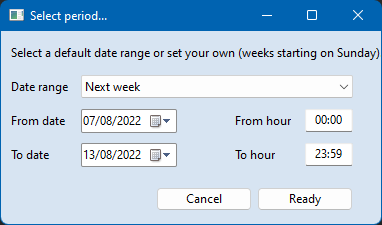

# Select Period (sample with DelphiVCL Python module)

## Description 
A simple window to select a valid range of dates and times using:
- the [DelphiVCL Python module](https://github.com/Embarcadero/DelphiVCL4Python) which supports Windows application development with Python, and is freely available via [GitHub](https://github.com/Embarcadero/DelphiVCL4Python) or the [PIP Python Package Manager](https://pypi.org/project/delphivcl/)
- the Fake Grid Layout concept developed in [Tkinter Fake Grid Layout over Place Manager](https://github.com/NestorDR/tkFakeGridLayout)

<div align="center">
  
</div>

Also, available [here](/other_sources) are the samples I used to learn the recently released DelphiVCL for Python library.

## Platform

### Development 
Python 3.10.4 on Windows 11 

### Requirements
```
pip install -r requirements.txt  
```

## Delphi VCL Documentation Wikis 
- [VCL - Visual Component Library](https://docwiki.embarcadero.com/Libraries/Alexandria/en/Vcl)
- [VCL.StdCtrls](http://docwiki.embarcadero.com/Libraries/en/Vcl.StdCtrls)
- [VCL.WinXCtrls](http://docwiki.embarcadero.com/Libraries/en/Vcl.WinXCtrls)
- [VCL.ExtCtrls](http://docwiki.embarcadero.com/Libraries/en/Vcl.ExtCtrls)
- [VCL.Dialogs](http://docwiki.embarcadero.com/Libraries/en/Vcl.Dialogs)
- [VCL.Themes](http://docwiki.embarcadero.com/Libraries/en/Vcl.Themes)
